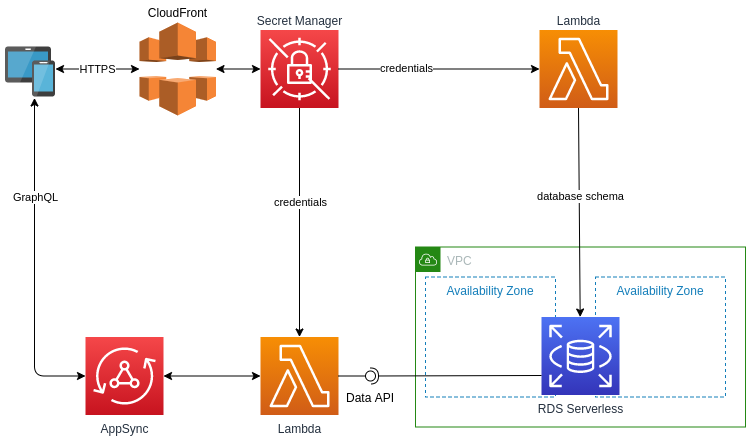

### CDK with AppSync GraphQL and Aurora Serverless Postgres

This CDK stack deploys a real-time GraphQL API built with AWS AppSync, Amazon Aurora Serverless Postgres, and AWS Lambda.



### Deploy the stack
   ```bash
   npx projen deploy
   ```

### RDS

Visit the [RDS console](https://console.aws.amazon.com/rds/home) and to sign in, you will use the ARN from the secret that was created by CDK.  
Once signed in, create the table by executing the following query:

```psql

```